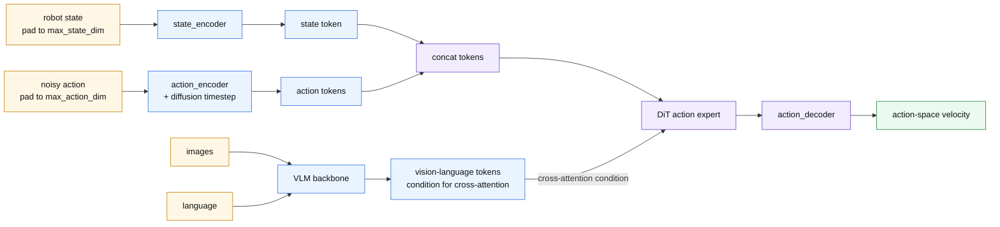
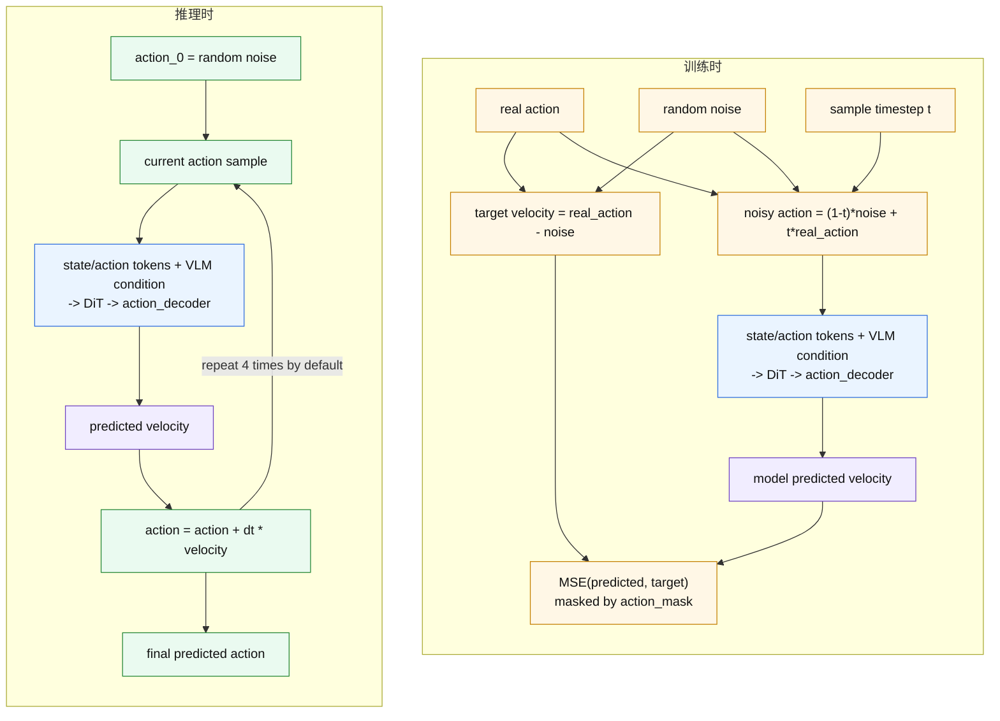
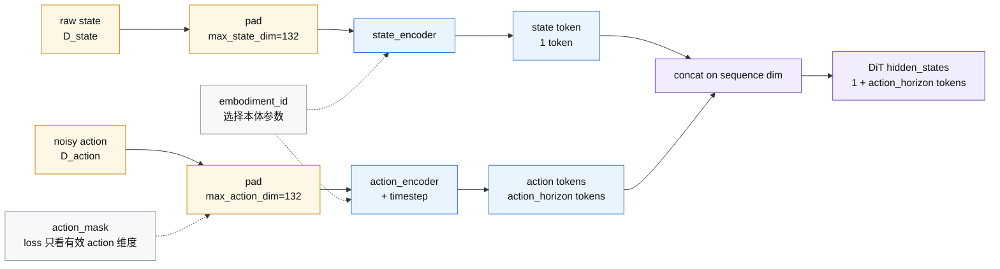

# GR00T N1.7 架构与新本体微调速览

本文档整理 GR00T N1.7 的核心模型结构，以及后续采集新本体机器人数据进行微调时通常需要修改的内容。

## 0. 速记版

GR00T N1.7 可以先记成三块：

```text
VLM backbone:
  处理图像和语言，输出 vision-language tokens

Action head:
  把 state 和 noisy action 编码成 tokens
  用 DiT 在 vision-language 条件下做 flow matching
  最后解码出 action

Processor / modality config:
  决定 state/action/video/language 怎么读、怎么归一化、怎么 pad、怎么反归一化
```

最关键的概念：

```text
state 是条件，不是预测目标
action 是预测目标
DiT 每一轮预测的是 flow matching velocity
最终 action 是从噪声迭代更新出来的
```

新本体微调时，优先改这些：

```text
1. 数据集 meta/modality.json
2. Python modality config
3. action representation，例如 RELATIVE EEF
4. embodiment tag / embodiment id
5. 确认 max_state_dim、max_action_dim、action_horizon 是否够用
```

通常不需要改：

```text
1. DiT 结构
2. action head 主体结构
3. VLM backbone 结构
```

## 1. 整体模型架构

GR00T N1.7 是一个 Vision-Language-Action 模型。整体可以理解为：

```text
图像 + 语言
  -> VLM backbone 提取 vision-language tokens

机器人 state + noisy action
  -> state/action encoder 编码成 state/action tokens

vision-language tokens 作为条件
state/action tokens 作为 DiT 输入
  -> DiT / diffusion action model
  -> action decoder
  -> 预测 action-space velocity
  -> flow matching 多步迭代得到最终 action
```

主要代码位置：

- `gr00t/model/gr00t_n1d7/gr00t_n1d7.py`
  - `Gr00tN1d7`: 完整模型，包含 backbone 和 action head。
  - `Gr00tN1d7ActionHead`: action head 主体。
- `gr00t/model/modules/qwen3_backbone.py`
  - Qwen3/Cosmos VLM backbone，负责图像和语言编码。
- `gr00t/model/modules/embodiment_conditioned_mlp.py`
  - 多本体 state/action encoder/decoder 的实现。
- `gr00t/model/modules/dit.py`
  - diffusion/DiT action expert。

## 2. DiT 的输入和条件

DiT 不是直接吃 raw state 和 raw action。它的输入分两部分：

```text
hidden_states:
  state token + noisy action tokens

encoder_hidden_states:
  VLM backbone 输出的 vision-language tokens
```

训练时，真实 action 会先和随机噪声混合成 `noisy_trajectory`。模型学习预测：

```text
velocity = real_action - noise
```

这里的 `velocity` 是 flow matching 里的去噪速度场，不是机器人控制意义上的关节速度或末端速度。最终 action 是推理时从随机噪声开始，循环多次：

```text
当前 noisy action -> DiT -> action decoder -> velocity -> 更新 action
```

默认 `num_inference_timesteps` 是 4。

下面先用一张总览图说明 DiT 周围的输入输出。重点是：`state` 和 `action` 先变成 token，图像和语言变成 condition，DiT 输出 hidden，再由 `action_decoder` 变成 velocity。



训练和推理的区别在于：训练时有真实 action 可以构造监督目标；推理时没有真实 action，只能从随机噪声开始迭代。



## 3. State Encoder 和 Action Encoder

`state_encoder` 和 `action_encoder` 是分开的。

```text
state_encoder:
  输入当前或历史机器人 state
  shape: [B, state_history_length, max_state_dim]
  输出 state token

action_encoder:
  输入 noisy action trajectory + diffusion timestep
  shape: [B, action_horizon, max_action_dim]
  输出 action tokens
```

默认配置里：

```text
max_state_dim = 132
max_action_dim = 132
```

如果某个机器人真实 state/action 维度小于 132，会 pad 到 132；loss 只在有效 action 维度上计算。

可以把 state/action encoder 理解成两个独立入口，最后在 token 维度拼接。`embodiment_id` 决定选择哪一路本体专属参数。



## 4. Action Horizon

`action_horizon` 是模型一次预测的未来动作步数，也就是 action chunk 长度。

例如：

```text
action_horizon = 16
action_dim = 7
```

表示一次预测未来 16 个控制时刻，每个时刻 7 维有效动作。模型内部仍会 pad 到 `max_action_dim`。

## 5. 多本体参数是怎么选的

action head 里有多本体条件化模块：

```text
state_encoder
action_encoder
action_decoder
```

这些模块内部使用 `CategorySpecificLinear`，参数形状类似：

```text
W: [num_embodiments, input_dim, output_dim]
b: [num_embodiments, output_dim]
```

每条样本会带一个 `embodiment_id`。forward 时按这个 id 选择对应本体的那一路参数：

```text
LIBERO -> embodiment_id = 2
Sharpa -> embodiment_id = 26
NEW_EMBODIMENT -> embodiment_id = 10
```

中间的 DiT action model 是共享的。可以理解为：

```text
本体专属输入适配器
  -> 共享 DiT action model
  -> 本体专属输出适配器
```

因此，如果先用 LIBERO 微调再用 Sharpa 微调，Sharpa 的本体专属分支不一定被 LIBERO 直接更新，但共享 DiT 已经被 LIBERO 改过，所以结果不一定等价于直接从 base model 微调 Sharpa。

## 6. Base Model、Pretrain Tags 和 Posttrain Tags

代码里 `Pretrain tags (baked into the base model nvidia/GR00T-N1.7-3B, inference-ready)` 的意思是：

```text
这些 embodiment tag 已经被官方 base checkpoint 支持，可以直接用于 inference。
```

这不等于这些 tag 都是某个具体下游任务的最终策略。`nvidia/GR00T-N1.7-3B` 是通用 base checkpoint，可以对 pretrain embodiments 做 zero-shot inference，也可以作为新任务微调起点。

论文里的训练 recipe 分为：

```text
Stage I: 大规模 egocentric human video pretraining
Stage II: aligned human-robot mid-training
Stage III: task-specific robot post-training
```

README 和代码没有明确说明开源的 `nvidia/GR00T-N1.7-3B` 精确对应论文第几阶段。更稳妥的理解是：它是通用 base checkpoint，不是纯 human-only Stage I checkpoint，也不是某个具体任务的 Stage III checkpoint。

## 7. 新本体微调需要改什么

采集新本体机器人数据后，一般不需要改 action head 结构。主要改数据格式、modality config 和本体 tag。

### 7.1 准备 LeRobot 数据

数据需要包含：

```text
video
state
action
language / task annotation
```

并在数据集的 `meta/modality.json` 里描述原始 state/action 向量怎么切片。例如把 `observation.state` 中的不同维度切成：

```text
state.left_eef
state.right_eef
state.left_gripper
state.right_gripper
```

loader 会根据 `meta/modality.json` 把原始数组切成对应的 group。

### 7.2 新增 Python Modality Config

需要写一个类似 `examples/SO100/so100_config.py` 或 `examples/R1_Lite_4_camera/r1_lite_config.py` 的配置文件。

它定义模型实际使用哪些输入输出：

```python
from gr00t.configs.data.embodiment_configs import register_modality_config
from gr00t.data.embodiment_tags import EmbodimentTag
from gr00t.data.types import (
    ActionConfig,
    ActionFormat,
    ActionRepresentation,
    ActionType,
    ModalityConfig,
)

my_robot_config = {
    "video": ModalityConfig(
        delta_indices=[0],
        modality_keys=["front", "wrist"],
    ),
    "state": ModalityConfig(
        delta_indices=[0],
        modality_keys=["left_eef", "right_eef", "left_gripper", "right_gripper"],
    ),
    "action": ModalityConfig(
        delta_indices=list(range(16)),
        modality_keys=["left_eef", "right_eef", "left_gripper", "right_gripper"],
        action_configs=[
            ActionConfig(
                rep=ActionRepresentation.RELATIVE,
                type=ActionType.EEF,
                format=ActionFormat.XYZ_ROTVEC,
                state_key="left_eef",
            ),
            ActionConfig(
                rep=ActionRepresentation.RELATIVE,
                type=ActionType.EEF,
                format=ActionFormat.XYZ_ROTVEC,
                state_key="right_eef",
            ),
            ActionConfig(
                rep=ActionRepresentation.ABSOLUTE,
                type=ActionType.NON_EEF,
                format=ActionFormat.DEFAULT,
                state_key="left_gripper",
            ),
            ActionConfig(
                rep=ActionRepresentation.ABSOLUTE,
                type=ActionType.NON_EEF,
                format=ActionFormat.DEFAULT,
                state_key="right_gripper",
            ),
        ],
    ),
    "language": ModalityConfig(
        delta_indices=[0],
        modality_keys=["annotation.human.task_description"],
    ),
}

register_modality_config(my_robot_config, embodiment_tag=EmbodimentTag.NEW_EMBODIMENT)
```

### 7.3 Relative EEF Action Space

如果新机器人使用相对末端动作，需要配置：

```python
ActionConfig(
    rep=ActionRepresentation.RELATIVE,
    type=ActionType.EEF,
    format=ActionFormat.XYZ_ROTVEC,
    state_key="left_eef",
)
```

含义是：

```text
数据中的 action.left_eef 是绝对 EEF target
当前 state.left_eef 是参考位姿
processor 会把 absolute action 转成 relative EEF delta 来训练
推理输出时再从 relative action 转回 absolute command
```

如果数据里 action 本来已经是 relative delta，就不要再让 processor 做一次 absolute-to-relative 转换，否则语义会错。

### 7.4 统计量

训练时会自动生成：

```text
meta/stats.json
meta/relative_stats.json
```

`relative_stats.json` 对 relative action 很重要，用于 normalization。相关逻辑在：

```text
gr00t/data/stats.py
gr00t/data/dataset/factory.py
```

### 7.5 Embodiment Tag

最简单做法是使用：

```text
EmbodimentTag.NEW_EMBODIMENT
```

微调命令传：

```bash
bash examples/finetune.sh \
  --base-model-path nvidia/GR00T-N1.7-3B \
  --dataset-path /path/to/my_robot_dataset \
  --modality-config-path /path/to/my_robot_config.py \
  --embodiment-tag NEW_EMBODIMENT \
  --output-dir /path/to/output
```

如果你要同时支持多个新机器人，不建议都复用 `NEW_EMBODIMENT`。需要新增自己的 `EmbodimentTag`，并给不同机器人分配不同的 `embodiment_id_mapping`。

### 7.6 触觉输入

如果新机器人能采集手部触觉数据，最小改法是把触觉当成额外的 `state` group，而不是改 VLM backbone。

推荐路径：

```text
触觉原始数据
  -> 预处理成低维 tactile vector
  -> 写入 state.tactile
  -> 和关节 / EEF state 拼接
  -> state_encoder
  -> DiT
```

也就是在新本体的 modality config 里把 tactile 加进 `state.modality_keys`：

```python
"state": ModalityConfig(
    delta_indices=[0],
    modality_keys=["left_eef", "right_eef", "left_hand", "right_hand", "tactile"],
)
```

这样 processor 会自动把各个 state group 归一化后拼接，再 pad 到 `max_state_dim`。只要总 state 维度不超过 `max_state_dim=132`，通常不需要改模型结构。

如果触觉是高维压力阵列、GelSight 图像或长时间序列，建议先用离线特征、PCA、小 MLP/CNN 等方法压成低维向量，再作为 `state.tactile` 输入。只有当触觉是核心输入且数据量足够时，才考虑新增 `tactile_encoder`，把 tactile token 和 state/action token 一起送进 DiT。

## 8. 微调时默认会训练哪些模块

默认 finetune 配置大致是：

```text
VLM language model: 不训练
VLM visual encoder: 不训练

state_encoder/action_encoder/action_decoder: 训练
position_embedding: 训练
DiT / diffusion action model: 训练
vlln / vl_self_attention: 默认训练
```

也就是说，新本体微调时，主要会适配本体相关 state/action 接口和共享 action model；backbone 通常保持冻结。

如果希望减少不同本体之间的干扰，可以考虑冻结共享 DiT，只训练本体相关 projector，但这需要确认当前 CLI 是否暴露了对应开关，或者修改 `FinetuneConfig`。

## 9. 新本体接入检查清单

1. 数据是否是 LeRobot 格式。
2. `meta/modality.json` 是否正确描述了 state/action 切片。
3. Python modality config 的 key 是否和 `meta/modality.json` 一致。
4. state 总维度是否小于等于 `max_state_dim=132`。
5. action 总维度是否小于等于 `max_action_dim=132`。
6. action horizon 是否不超过模型配置的 `action_horizon`。
7. relative EEF 的 `state_key` 是否指向正确的 EEF state。
8. action 格式是 `XYZ_ROTVEC` 还是 `XYZ_ROT6D`，要和数据维度一致。
9. 如果加入触觉，是否已作为 `state.tactile` 写入并计入 state 统计量。
10. 训练时是否生成了 `stats.json` 和 `relative_stats.json`。
11. 推理时使用的 `embodiment_tag` 是否和训练时一致。
